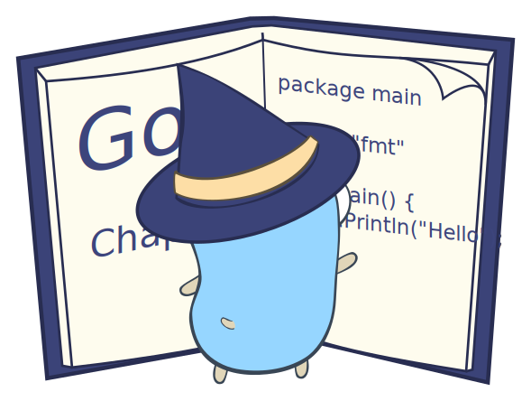

# Golang Web Wiki

This is just a simple web application used to create wiki, update, and view created wiki.
This project contains lots of programming concepts using Go programming language, such as struct,
method, and pointer. This project isn't use 3rd party library, instead use `net/http`,
`html/template` and `regexp`.

    

##  Contributing

Pull requests are welcome. For major changes, please open an issue first to discuss
what you would like to change.

##  Credits

The idea was from [Writing Web Application](https://go.dev/doc/articles/wiki/).

The svg icons resources are from [Gophers](https://github.com/egonelbre/gophers).

Copyright :copyright: 2022. This project is under [CC0](LICENSE) licensed.